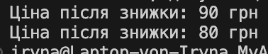

# Strategy
Ідея стратегії: 

дозволяє вибирати алгоритм поведінки під час виконання.

Як працює код: 

Ми можемо застосовувати різні знижки без зміни основного коду — просто передаючи іншу функцію.

Навіщо: 

можна легко міняти логіку без зміни основного коду.

## Код
```csharp
using System;

class Discount
{
    public Func<double, double> strategy;

    public void SetStrategy(Func<double, double> s) => strategy = s;
    public void Apply(double price)
    {
        Console.WriteLine("Ціна після знижки: " + strategy(price) + " грн");
    }
}

class Program
{
    static void Main()
    {
        var d = new Discount();

        d.SetStrategy(p => p * 0.9); // 10% знижка
        d.Apply(100);

        d.SetStrategy(p => p * 0.8); // 20% знижка
        d.Apply(100);
    }
}
```
## Результат

